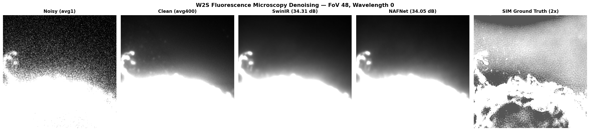

# InverseOps

[](https://github.com/tyy0811/inverseops/actions/workflows/ci.yaml)

**Image restoration for fluorescence microscopy** — denoising and super-resolution on the [W2S (Widefield2SIM)](https://github.com/ivrl/w2s) dataset with real Poisson-Gaussian noise. Production pipeline with FastAPI inference, Docker deployment, ONNX export, and Prometheus monitoring.

Portfolio project demonstrating production ML engineering and methodology discipline for computational imaging. Emphasis on honest evaluation: calibrated harness, frozen specimen-level splits, and documented methodology catches.



*W2S fluorescence microscopy denoising. Left to right: noisy single-frame capture, 400-frame average (clean reference), SwinIR denoised, NAFNet denoised. Right: SIM high-resolution ground truth (2x) — the target for future super-resolution work, not a model output.*

## Results

SwinIR and NAFNet retrained on 94 W2S FoVs with real microscopy noise (Poisson-Gaussian from frame averaging). Evaluated on 13 held-out FoVs, reported as mean +/- std across FoVs.

| Noise Level | SwinIR PSNR (dB) | SwinIR SSIM | NAFNet PSNR (dB) | NAFNet SSIM |
|-------------|------------------|-------------|------------------|-------------|
| avg1 | 34.31 +/- 2.84 | 0.925 +/- 0.024 | 34.05 +/- 2.72 | 0.921 +/- 0.025 |
| avg2 | 36.34 +/- 2.63 | 0.940 +/- 0.019 | 35.99 +/- 2.52 | 0.939 +/- 0.019 |
| avg4 | 38.17 +/- 2.44 | 0.954 +/- 0.014 | 37.84 +/- 2.43 | 0.952 +/- 0.015 |
| avg8 | 39.79 +/- 2.36 | 0.964 +/- 0.011 | 39.40 +/- 2.38 | 0.962 +/- 0.011 |
| avg16 | 41.09 +/- 2.41 | 0.971 +/- 0.009 | 40.69 +/- 2.47 | 0.970 +/- 0.009 |

SwinIR shows a small consistent advantage over NAFNet (0.3-0.4 dB across all noise levels). Both models show the expected pattern of increasing PSNR with decreasing noise.

### Model Comparison

| | SwinIR | NAFNet |
|---|--------|--------|
| Best val PSNR | 37.56 dB | 37.31 dB |
| Best epoch | 11 | 8 |
| Training time (A100) | 85 min | 20 min |
| GPU memory | 24.0 GB | 1.5 GB |

NAFNet trains ~4x faster and uses ~16x less GPU memory — depthwise separable convolutions and SimpleGate (gated activation) replace SwinIR's heavier Swin attention blocks. For memory-constrained inference (edge deployment, batch processing), NAFNet's footprint is the deciding factor; for absolute quality, SwinIR's 0.3 dB advantage holds.

### Methodology

Evaluation harness verified via calibration check against W2S pretrained baselines (DnCNN, MemNet) before trusting retrained model numbers. See [EVALUATION.md](EVALUATION.md) for protocol, calibration results, and test set caveats. See [DECISIONS.md](DECISIONS.md) for 11 architectural decisions with rationale. See [docs/tradeoffs.md](docs/tradeoffs.md) for 9 methodology catches across V1-V3, all caught during V3 development before shipping.

## Dataset

[W2S (Widefield2SIM)](https://github.com/ivrl/w2s) — fluorescence microscopy benchmark with real Poisson-Gaussian noise from frame averaging. 120 FoVs x 3 wavelengths, noise levels from single-frame (avg1) to 400-frame average (avg400, clean reference). SIM ground truth at 2x resolution for super-resolution.

Splits: 94 train / 13 val / 13 test FoVs. Split at FoV level (not file level) to prevent data leakage. Frozen in `inverseops/data/splits.json`.

## Inference API

Production serving layer with three endpoints: `POST /restore`, `GET /health`, `GET /metrics`. The API is model-agnostic — it loads whichever checkpoint is configured and serves inference via FastAPI. The `noise_level` parameter uses sigma indexing from the V2 synthetic-noise pipeline; for W2S avg-level models, point the API at the appropriate checkpoint directly.

**Restore an image:**

```bash
curl -X POST http://localhost:8000/restore \
  -F "file=@noisy_image.png" \
  -F "noise_level=25" \
  --output restored.png
```

The restored PNG is returned in the body. Structured QC metadata is in response headers:

```json
{
  "status": "completed",
  "decision": "good",
  "metrics": {"inference_ms": 5106.0, "output_valid": true},
  "input_analysis": {
    "noise_level_source": "user_supplied",
    "noise_level_sigma": 25.0,
    "in_calibrated_range": true
  },
  "model_info": {"backend": "swinir_sigma25", "version": "0.1.0"}
}
```

The `noise_level` parameter selects the checkpoint trained for that noise level. If omitted, the system estimates the noise via wavelet MAD and routes to the closest match. The `decision` field reports `good`, `review`, or `out_of_range` based on whether the input falls within the model's calibrated range.

**Note on V2/V3 vocabulary:** The serving layer was built for V2's synthetic-sigma models and retains that vocabulary in field names and checkpoint identifiers (`swinir_sigma25`). The V3 W2S models work through the same API but the sigma field names are vestigial — they identify which checkpoint is loaded, not a noise model. When serving W2S models, `noise_level_sigma` in the response is a legacy label and does not correspond to a Gaussian sigma; the model is trained on frame-averaging noise levels (avg1-avg16). A future cleanup would rename these fields, but this would require coordinated changes across the API schema, the QC layer, and any downstream consumers.

**Example: out-of-range input**

```json
{
  "status": "completed",
  "decision": "out_of_range",
  "metrics": {"inference_ms": 5230.0, "output_valid": true},
  "input_analysis": {
    "noise_level_source": "estimated",
    "noise_level_sigma": 78.4,
    "estimation_method": "wavelet_mad",
    "in_calibrated_range": false
  },
  "model_info": {"backend": "swinir_sigma50", "version": "0.1.0"}
}
```

The model still returns a restored image, but the `decision: out_of_range` flag tells downstream consumers that the input fell outside the calibrated training range and the result should be treated cautiously.

**Health check and Prometheus metrics:**

```bash
curl http://localhost:8000/health
curl http://localhost:8000/metrics   # Prometheus-compatible
```

Exposed counters: `restore_requests_total`, `restore_completed_total`, `restore_failed_total`, `restore_latency_seconds`, `qc_decision_total{decision}`.

**Start the server:**

```bash
make serve
```

### Docker

```bash
docker-compose up
# API available at http://localhost:8000

# Alternative: pull from GHCR
docker pull ghcr.io/tyy0811/inverseops:latest
```

### Monitoring

Launch with Prometheus + Grafana for production observability:

```bash
make docker-monitoring
# Grafana: http://localhost:3000 (auto-provisioned dashboard)
# Prometheus: http://localhost:9090
```

JSON structured logs with request ID correlation:

```json
{"request_id": "abc-123", "event": "restore_request", "level": "info", "timestamp": "2026-04-08T12:00:00Z"}
```

## Quick Start

```bash
make install
make test           # 127 tests, no GPU required
make serve          # Start inference API

# For W2S training (requires Modal)
modal run scripts/download_w2s.py   # Download dataset
python scripts/preflight.py --data-root data/test_fixtures/w2s  # Pre-flight check
```

## Training

Trained on Modal cloud GPU (A100). W2S data lives on a persistent Modal volume; pretrained weights are baked into the image.

```bash
pip install modal && modal setup

# Download W2S data (one-time)
modal run scripts/download_w2s.py

# Run pre-flight checklist (mandatory before every GPU launch)
python scripts/preflight.py --data-root data/test_fixtures/w2s

# SwinIR denoising
modal run --detach scripts/modal_train.py --config configs/w2s_denoise_swinir.yaml --wandb

# NAFNet denoising
modal run --detach scripts/modal_train.py --config configs/w2s_denoise_nafnet.yaml --wandb

# Resume from checkpoint
modal run --detach scripts/modal_train.py --config configs/w2s_denoise_swinir.yaml --resume

# Download results
modal volume get inverseops-vol outputs/training_w2s_swinir/ outputs/local/swinir/
```

## Evaluation

Eval harness loads frozen splits, reports mean +/- std per noise level, calls `dataset.denormalize()` before computing PSNR/SSIM. Verified via calibration check against W2S pretrained baselines before trusting any retrained model numbers.

```bash
# Evaluate retrained checkpoint
python scripts/run_evaluation.py \
    --data-root /data/w2s/data/normalized \
    --checkpoint outputs/training_w2s_swinir/best.pt \
    --model swinir

# Calibration check (W2S pretrained baselines)
modal run scripts/modal_calibration.py
```

W&B project: [inverseops](https://wandb.ai/janedoraemon-universit-t-hamburg/inverseops)

## Project Structure

```
inverseops/
    config.py       # Config validation (model + dataset registry checks)
    data/
        w2s.py      # W2SDataset (denoise + SR, FoV-level splits)
        splits.json # Frozen train/val/test splits (94/13/13 FoVs)
    models/         # SwinIR + NAFNet architectures and wrappers
    training/       # Trainer with early stopping, denormalized PSNR, sanity assertions
    evaluation/     # PSNR/SSIM metrics
    serving/        # FastAPI inference API with QC layer, structlog
    tracking/       # W&B integration with tags and run naming
    export/         # ONNX export utilities
scripts/
    preflight.py        # Training readiness gate (mandatory before GPU launch)
    modal_train.py      # Modal cloud GPU training
    run_training.py     # Local training CLI
    run_evaluation.py   # Eval harness with denormalize + mean+/-std
    modal_calibration.py # Calibration check against W2S baselines
    download_w2s.py     # Download W2S data to Modal volume
configs/
    w2s_denoise_swinir.yaml  # SwinIR denoising on W2S
    w2s_denoise_nafnet.yaml  # NAFNet denoising on W2S
    w2s_sr_swinir_2x.yaml   # SwinIR super-resolution 2x
docker/                      # Inference + monitoring deployment
tests/                       # 127 tests (data pipeline, metrics, training, eval harness)
docs/
    tradeoffs.md             # 9 methodology catches across V1-V3
EVALUATION.md                # Eval protocol (written before results)
DECISIONS.md                 # 11 architectural decisions with rationale
```

## References

- **SwinIR**: Liang et al., [SwinIR: Image Restoration Using Swin Transformer](https://arxiv.org/abs/2108.10257), ICCVW 2021
- **NAFNet**: Chen et al., [Simple Baselines for Image Restoration](https://arxiv.org/abs/2204.04676), ECCV 2022
- **W2S**: Zhou et al., [W2S: Microscopy Data with Joint Denoising and Super-Resolution for Widefield to SIM Mapping](https://arxiv.org/abs/2003.05961), ECCVW 2020
- **Modal**: Cloud GPU platform used for training — [modal.com](https://modal.com)

## Runtime Dependencies

**Model weights:**
- **SwinIR** pretrained weights: loaded from [official GitHub releases](https://github.com/JingyunLiang/SwinIR/releases) at build time (Apache 2.0)
- **NAFNet** pretrained weights: mirrored to this repo's [`pretrained-weights-v1`](https://github.com/tyy0811/inverseops/releases/tag/pretrained-weights-v1) release for build stability. Original source: [megvii-research/NAFNet](https://github.com/megvii-research/NAFNet) (MIT).

**Datasets:**
- **W2S**: cloned from [ivrl/w2s](https://github.com/ivrl/w2s) via `scripts/download_w2s.py`
