# InverseOps

[](https://github.com/tyy0811/inverseops/actions/workflows/ci.yaml)

**Domain-adapting a pretrained image restoration model (SwinIR) for fluorescence microscopy denoising.** Pretrained models trained on natural images degrade significantly on scientific imaging; this project quantifies that gap and closes it through targeted fine-tuning, achieving **+10 dB PSNR at high noise levels**.

Full pipeline: data loading, cloud GPU training (Modal A100), evaluation, FastAPI inference API, and Docker deployment.

## Results

Fine-tuned SwinIR on FMD Confocal FISH data (A100 GPU, 16 epochs with early stopping, cosine LR schedule).

```mermaid
---
config:
    xyChart:
        width: 600
        height: 400
---
xychart-beta
    title "PSNR: Pretrained vs Fine-tuned (dB)"
    x-axis ["sigma=15", "sigma=25", "sigma=50"]
    y-axis "PSNR (dB)" 20 --> 42
    bar [36.65, 30.79, 23.47]
    bar [37.73, 36.24, 33.51]
```



| Noise level | Pretrained | Fine-tuned | Delta PSNR | Delta SSIM |
|-------------|-----------|-----------|------------|------------|
| sigma=15 | 36.65 dB | 37.73 dB | **+1.08 dB** | +0.066 |
| sigma=25 | 30.79 dB | 36.24 dB | **+5.45 dB** | +0.228 |
| sigma=50 | 23.47 dB | 33.51 dB | **+10.04 dB** | +0.457 |

Domain-specific fine-tuning dramatically improves denoising, especially at high noise levels (+10 dB at sigma=50).

### Example (sigma=50)

| Clean | Noisy (16.09 dB) | Denoised (27.36 dB) |
|:-----:|:-----------------:|:-------------------:|
|  |  |  |

Even at sigma=50 — where the noisy input is barely recognizable (16 dB) — the fine-tuned model recovers cellular structure clearly (27 dB).

### Inference Latency (CPU)

Benchmarked on CPU — the cost-sensitive deployment target. GPU inference is orders of magnitude faster (A100 training ran at ~0.1s/step).

| Backend | 128x128 (ms) | 256x256 (ms) |
|---------|-------------|-------------|
| PyTorch FP32 | 12,475 | 55,933 |
| ONNX Runtime | 5,106 | 19,842 |
| **Speedup** | **2.3x** | **2.8x** |

ONNX export succeeded (52 MB, opset 17, dynamic axes).

## Dataset

[FMD (Fluorescence Microscopy Denoising)](https://zenodo.org/records/3713545) — a benchmark dataset of fluorescence microscopy images across multiple modalities (Confocal, Two-Photon, Wide-Field). This project uses the Confocal FISH subset with ground truth images averaged from 50 captures. Synthetic Gaussian noise at sigma 15, 25, 50 is added to create clean/noisy pairs for training and evaluation.

## Inference API

Three endpoints: `POST /restore`, `GET /health`, `GET /metrics`.

**Restore an image:**

```bash
curl -X POST http://localhost:8000/restore \
  -F "file=@noisy_image.png" \
  -F "noise_level=25" \
  --output restored.png
```

The restored PNG is returned in the body. Structured QC metadata is in response headers:

```json
{
  "status": "completed",
  "decision": "good",
  "metrics": {"inference_ms": 5106.0, "output_valid": true},
  "input_analysis": {
    "noise_level_source": "user_supplied",
    "noise_level_sigma": 25.0,
    "in_calibrated_range": true
  },
  "model_info": {"backend": "swinir_sigma25", "version": "0.1.0"}
}
```

The `noise_level` parameter selects the checkpoint trained for that sigma (15, 25, or 50). Training one specialized model per noise level produces better results than a single model covering all levels — this is visible in the +10 dB improvement at sigma=50. If `noise_level` is omitted, the system estimates it via wavelet MAD and defaults to the sigma=25 model. The `decision` field reports `good`, `review`, or `out_of_range` based on whether the input falls within the model's calibrated range.

**Example: out-of-range input**

```json
{
  "status": "completed",
  "decision": "out_of_range",
  "metrics": {"inference_ms": 5230.0, "output_valid": true},
  "input_analysis": {
    "noise_level_source": "estimated",
    "noise_level_sigma": 78.4,
    "estimation_method": "wavelet_mad",
    "in_calibrated_range": false
  },
  "model_info": {"backend": "swinir_sigma50", "version": "0.1.0"}
}
```

The model still returns a restored image, but the `decision: out_of_range` flag tells downstream consumers that the input fell outside the calibrated training range and the result should be treated cautiously.

**Health check and Prometheus metrics:**

```bash
curl http://localhost:8000/health
curl http://localhost:8000/metrics   # Prometheus-compatible
```

Exposed counters: `restore_requests_total`, `restore_completed_total`, `restore_failed_total`, `restore_latency_seconds`, `qc_decision_total{decision}`.

**Start the server:**

```bash
make serve
```

### Docker

```bash
docker-compose up
# API available at http://localhost:8000

# Alternative: pull from GHCR
docker pull ghcr.io/tyy0811/inverseops:latest
```

### Monitoring

Launch with Prometheus + Grafana for production observability:

```bash
make docker-monitoring
# Grafana: http://localhost:3000 (auto-provisioned dashboard)
# Prometheus: http://localhost:9090
```

JSON structured logs with request ID correlation:

```json
{"request_id": "abc-123", "event": "restore_request", "level": "info", "timestamp": "2026-04-08T12:00:00Z"}
```

## Quick Start

```bash
make install
bash scripts/download_data.sh
make test
make serve  # Start inference API
```

## Training

Trained on Modal cloud GPU (A100) — local hardware is CPU-only, so Modal provides on-demand GPU access without managing infrastructure. The training code itself is standard PyTorch and can run on any GPU environment; Modal is just the convenient cloud target.

```bash
pip install modal && modal setup

# SwinIR denoising (default)
modal run --detach scripts/modal_train.py --batch-size 4

# NAFNet denoising
modal run --detach scripts/modal_train.py --config configs/denoise_nafnet_sigma25.yaml

# SwinIR SR 2x
modal run --detach scripts/modal_train.py --config configs/sr_swinir_2x.yaml

# With W&B logging
modal secret create wandb-api-key WANDB_API_KEY=<your-key>
modal run --detach scripts/modal_train.py --wandb

# Resume from checkpoint
modal run --detach scripts/modal_train.py --batch-size 4 --resume

# Download results
modal volume get inverseops-vol outputs/training/checkpoints/ outputs/modal_training/checkpoints/
```

Data is baked into the Modal image (no volume IO bottleneck). Supports `--preload` for in-memory dataset caching and `--resume` for checkpoint recovery.

### Local

```bash
python scripts/run_training.py \
    --config configs/denoise_swinir.yaml \
    --preload --no-wandb
```

## Evaluation

```bash
# Baseline: pretrained SwinIR on microscopy
python scripts/run_evaluation.py \
    --microscopy-root data/raw/fmd \
    --output-csv artifacts/baseline/baseline_metrics.csv

# Compare fine-tuned vs pretrained
python scripts/run_evaluation.py \
    --microscopy-root data/raw/fmd/Confocal_FISH/gt \
    --checkpoint outputs/training/checkpoints/best.pt \
    --model-mode finetuned \
    --output-csv artifacts/compare_finetuned/finetuned_full_metrics.csv \
    --baseline-csv artifacts/baseline/baseline_summary.csv \
    --no-wandb --allow-missing-datasets
```

### V2 Tier 2: Architecture Comparison (SwinIR vs NAFNet)

We fine-tuned NAFNet-SIDD-width32 on the same FMD Confocal FISH synthetic Gaussian denoising benchmark as V1 SwinIR. Both models used identical training settings: L1 loss, AdamW optimizer, cosine LR schedule, early stopping with patience 10, batch size 4.

| Model | Val PSNR | Best Epoch | Early Stop | Training Time | GPU Memory |
|-------|----------|------------|------------|---------------|------------|
| SwinIR (grayscale denoising pretrained) | **36.24 dB** | 16 | Epoch 16 | ~15 min | 8.7 GB |
| NAFNet (SIDD real-noise pretrained) | 30.95 dB | 31 | Epoch 41 | ~123 min | 1.1 GB |

**At matched training budget (epoch 16)**, the gap is 5.47 dB. NAFNet's additional 25 epochs of training yielded only 0.18 dB of further improvement, indicating genuine convergence rather than truncated optimization.

**Interpretation.** The 5.3-5.5 dB gap reflects primarily a **pretraining task mismatch**, not an architectural difference. SwinIR's checkpoint was pretrained on additive Gaussian noise denoising — the exact task we fine-tune for, just on natural images instead of microscopy. NAFNet's SIDD checkpoint was pretrained on real smartphone noise (signal-dependent, spatially correlated, sensor-structured), which transfers poorly to unstructured Gaussian noise. Secondary contributors include the RGB→grayscale channel adaptation (NAFNet runs in RGB mode with grayscale input replicated to 3 channels) and the loss function (NAFNet's official training uses PSNR loss, not L1).

**What this comparison shows:** given two pretrained image restoration models, which adapts better to grayscale microscopy denoising under identical fine-tuning conditions? SwinIR adapts much better. **What it does not show:** that SwinIR's architecture is inherently better than NAFNet's. A fair architecture-only comparison would require both models pretrained on the same task, which was outside V2 scope.

**Practical lesson:** pretraining task match matters more than architecture choice for domain adaptation with limited training data. When fine-tuning from public weights, ask "what task were these weights trained on?" before "which architecture is strongest on leaderboards?"

NAFNet retains advantages not visible in PSNR: ~8x lower GPU memory (1.1 GB vs 8.7 GB), simpler architecture for deployment. For memory-constrained applications, NAFNet may be preferable despite the PSNR gap.

### V2 Tier 2: Real-Noise Fine-Tuning

SwinIR fine-tuned on FMD real noisy/clean pairs (specimen-level splits, no synthetic noise).

| Model | Noise Source | Val PSNR | Best Epoch | Early Stop |
|-------|-------------|----------|------------|------------|
| SwinIR (synthetic sigma=25) | Gaussian | 36.24 dB | 16 | Epoch 16 |
| SwinIR (real-noise) | FMD Confocal | 38.89 dB | 9 | Epoch 19 |

The real-noise result (38.89 dB) is not directly comparable to the synthetic result (36.24 dB) — the noise distributions differ. Real FMD confocal noise is lower-magnitude than synthetic sigma=25 Gaussian, and the averaged ground truth (50 captures) provides a cleaner target. These are separate training regimes reported side-by-side, not a leaderboard.

W&B project: [inverseops](https://wandb.ai/janedoraemon-universit-t-hamburg/inverseops)

## Project Structure

```
inverseops/
    config.py       # Config validation
    data/           # Dataset loaders, transforms, degradations
    models/         # SwinIR + NAFNet architectures and wrappers
    training/       # Trainer with early stopping, AMP, losses
    evaluation/     # PSNR/SSIM metrics
    serving/        # FastAPI inference API with QC layer, structlog
    tracking/       # W&B integration with tags and run naming
    export/         # ONNX export utilities
scripts/
    modal_train.py      # Modal cloud GPU training (multi-config)
    run_training.py     # Local training CLI
    run_evaluation.py   # Evaluation pipeline
    run_onnx_export.py  # ONNX export + benchmark
    run_latency_bench.py # PyTorch latency benchmark
configs/
    denoise_swinir.yaml          # SwinIR denoising (synthetic noise)
    denoise_nafnet_sigma25.yaml  # NAFNet denoising (synthetic noise)
    denoise_swinir_realnoise.yaml # SwinIR denoising (FMD real noise)
    sr_swinir_2x.yaml            # SwinIR super-resolution 2x
docker/
    Dockerfile          # Inference container
    Dockerfile.train    # GPU training container (CUDA 12.1)
    docker-compose.yaml # Deployment + monitoring profile
    prometheus.yaml     # Prometheus scrape config
    grafana_dashboard.json # 4-panel API dashboard
tests/                  # Unit and integration tests
docs/
    tradeoffs.md        # V2 design decisions
```

**Tests:** Data pipeline determinism, PSNR/SSIM on known inputs, QC decision logic, API endpoint integration (health, restore, metrics, oversized upload rejection, NaN detection), Pydantic schema roundtrips, import sanity checks.

## References

- **SwinIR**: Liang et al., [SwinIR: Image Restoration Using Swin Transformer](https://arxiv.org/abs/2108.10257), ICCVW 2021
- **NAFNet**: Chen et al., [Simple Baselines for Image Restoration](https://arxiv.org/abs/2204.04676), ECCV 2022
- **FMD**: Zhang et al., [A Poisson-Gaussian Denoising Dataset with Real Fluorescence Microscopy Images](https://arxiv.org/abs/1811.12751), CVPR 2019
- **Modal**: Cloud GPU platform used for training — [modal.com](https://modal.com)

## Runtime Dependencies

**Model weights:**
- **SwinIR** pretrained weights: loaded from [official GitHub releases](https://github.com/JingyunLiang/SwinIR/releases) at build time (Apache 2.0)
- **NAFNet** pretrained weights: mirrored to this repo's [`pretrained-weights-v1`](https://github.com/tyy0811/inverseops/releases/tag/pretrained-weights-v1) release for build stability. Original source: [megvii-research/NAFNet](https://github.com/megvii-research/NAFNet) (MIT). Mirrored because the original distribution is on Google Drive, which is not suitable for automated builds.

**Datasets:**
- **FMD**: downloaded from [Zenodo 3713545](https://zenodo.org/records/3713545) at setup time
