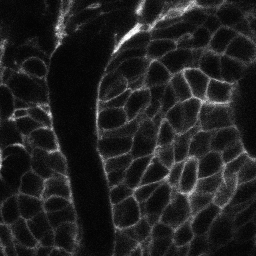
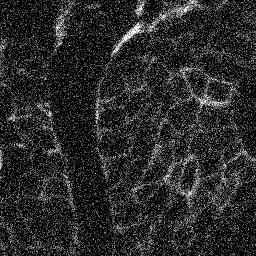

# InverseOps

Microscopy image denoising via SwinIR fine-tuning.

## Results

Fine-tuned SwinIR on FMD microscopy data (A100 GPU, 16 epochs with early stopping).



```mermaid
---
config:
    xyChart:
        width: 600
        height: 400
---
xychart-beta
    title "PSNR: Pretrained vs Fine-tuned (dB)"
    x-axis ["sigma=15", "sigma=25", "sigma=50"]
    y-axis "PSNR (dB)" 20 --> 42
    bar [36.65, 30.79, 23.47]
    bar [37.73, 36.24, 33.51]
```

| Noise level | Pretrained | Fine-tuned | Delta PSNR | Delta SSIM |
|-------------|-----------|-----------|------------|------------|
| sigma=15 | 36.65 dB | 37.73 dB | **+1.08 dB** | +0.066 |
| sigma=25 | 30.79 dB | 36.24 dB | **+5.45 dB** | +0.228 |
| sigma=50 | 23.47 dB | 33.51 dB | **+10.04 dB** | +0.457 |

Domain-specific fine-tuning dramatically improves denoising, especially at high noise levels (+10 dB at sigma=50).

### Example (sigma=50)

| Clean | Noisy (16.09 dB) | Denoised (27.36 dB) |
|:-----:|:-----------------:|:-------------------:|
|  |  |  |

## Quick Start

```bash
make install
bash scripts/download_data.sh   # Creates data directories
make test
```

## Training

### Modal cloud GPU

```bash
pip install modal && modal setup

# Full training on A100 (bs=4, 100 epochs with early stopping)
modal run --detach scripts/modal_train.py --batch-size 4

# Resume from checkpoint
modal run --detach scripts/modal_train.py --batch-size 4 --resume

# Download results
modal volume get inverseops-vol outputs/training/checkpoints/ outputs/modal_training/checkpoints/
```

Data is baked into the Modal image (no volume IO bottleneck). Supports `--preload` for in-memory dataset caching and `--resume` for checkpoint recovery.

### Local

```bash
python scripts/run_training.py \
    --config configs/denoise_swinir.yaml \
    --preload --no-wandb
```

## Evaluation

```bash
# Baseline: pretrained SwinIR on microscopy
python scripts/run_evaluation.py \
    --microscopy-root data/raw/fmd \
    --output-csv artifacts/baseline/baseline_metrics.csv

# Compare fine-tuned vs pretrained
python scripts/run_evaluation.py \
    --microscopy-root data/raw/fmd/Confocal_FISH/gt \
    --checkpoint outputs/training/checkpoints/best.pt \
    --model-mode finetuned \
    --output-csv artifacts/compare_finetuned/finetuned_full_metrics.csv \
    --baseline-csv artifacts/baseline/baseline_summary.csv \
    --no-wandb --allow-missing-datasets
```

## Project Structure

```
inverseops/
    data/           # Dataset loaders, transforms, degradations
    models/         # SwinIR architecture and wrappers
    training/       # Trainer with early stopping, losses
    evaluation/     # PSNR/SSIM metrics
    serving/        # REST API schemas (planned)
    tracking/       # W&B integration
scripts/
    modal_train.py      # Modal cloud GPU training
    run_training.py     # Local training CLI
    run_evaluation.py   # Evaluation pipeline
configs/
    denoise_swinir.yaml # Training configuration
tests/                  # Unit and integration tests
```
